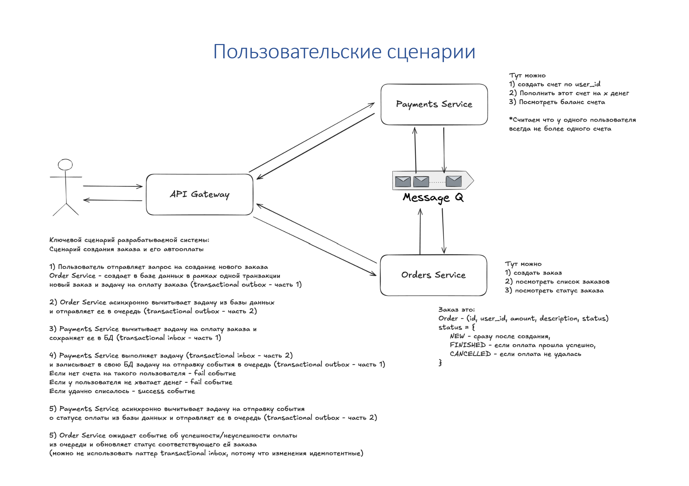

# Интернет-магазин «Гоzон»

Учебный проект по конструированию программного обеспечения\
Домашняя работа №4 — **Асинхронное межсервисное взаимодействие**

## Цель работы

Целью проекта является разработка микросервисной системы интернет-магазина «Гоzон» с корректной и надёжной обработкой заказов и оплат.

Основной фокус:

* асинхронное взаимодействие микросервисов,
* гарантии доставки сообщений,
* семантика **effectively exactly once** при списании денег,
* применение паттернов **Transactional Outbox / Inbox**.
* реализация фронтенд-части приложения.
* Реализация реального отслеживания заказа через WebSocket + push-уведомления.

---

## Описание системы

Система предназначена для:

* создания и управления заказами пользователей;
* асинхронной оплаты заказов;
* управления пользовательскими счетами (баланс);
* отслеживания статуса заказа в реальном времени.

Каждый HTTP-запрос выполняется **от имени пользователя**, идентифицируемого по `user_id`.

---

## Архитектура

Система построена по микросервисной архитектуре и состоит из следующих компонентов:

### 1. API Gateway

* Принимает все входящие HTTP-запросы от клиента
* Выполняет **только routing**
* Проксирует запросы в Orders Service и Payments Service
* Не содержит бизнес-логики

### 2. Orders Service

Отвечает за работу с заказами:

Функциональность:

* создание заказа;
* просмотр списка заказов пользователя;
* просмотр статуса конкретного заказа.

Ответственность:

* хранение заказов;
* запуск процесса оплаты **асинхронно**;
* обновление статуса заказа по результату оплаты.

Используемые паттерны:

* **Transactional Outbox** — при создании заказа;
* идемпотентная обработка событий оплаты.

### 3. Payments Service

Отвечает за работу с пользовательскими счетами и оплатами:

Функциональность:

* создание счёта пользователя (не более одного);
* пополнение счёта;
* просмотр баланса;
* обработка оплаты заказа.

Ответственность:

* списание денег со счёта;
* обеспечение семантики **exactly once**;
* публикация результата оплаты.

Используемые паттерны:

* **Transactional Inbox** — для входящих сообщений;
* **Transactional Outbox** — для исходящих событий;
* блокировка строки счёта (`SELECT … FOR UPDATE`) для защиты баланса.

### 4. Message Broker (RabbitMQ)

* Передача событий между Orders Service и Payments Service
* Гарантия доставки **at-least-once**
* Идемпотентность достигается на уровне сервисов

### 5. Frontend

* Веб-приложение (React)
* Взаимодействует с бэкендом через REST API
* Позволяет:

  * создавать заказы;
  * управлять балансом;
  * наблюдать статус заказа

### 6. WebSocket + Push-уведомления

* Клиент подключается к WebSocket после создания заказа
* При изменении статуса заказа сервер отправляет push-уведомление
* Реализовано через FastAPI WebSockets + Redis Pub/Sub

---

## Пользовательские сценарии



### Сценарий создания заказа и автоплаты (асинхронный)

1. Пользователь отправляет запрос на создание заказа в **Orders Service**
2. Orders Service:

   * в одной транзакции сохраняет заказ (`status = NEW`);
   * создаёт событие `PaymentRequested` в таблице Outbox
3. Фоновый dispatcher публикует событие в RabbitMQ
4. Payments Service:

   * получает сообщение;
   * фиксирует его в Inbox (защита от дублей);
   * проверяет счёт и баланс;
   * списывает деньги (или формирует ошибку);
   * сохраняет результат оплаты;
   * создаёт событие `PaymentResult` в Outbox
5. Payments Service публикует результат оплаты
6. Orders Service:

   * получает событие об оплате;
   * обновляет статус заказа:

     * `FINISHED` — если оплата успешна
     * `CANCELLED` — если оплата не удалась
7. Клиент получает push-уведомление через WebSocket

---

## Гарантии и надёжность

* **At-least-once delivery** — обеспечивается RabbitMQ
* **Exactly once списание**:

  * уникальность `order_id` в платежах;
  * Inbox-таблица для дедупликации сообщений;
* **Корректность баланса**:

  * операции над балансом выполняются атомарно;
  * используется блокировка строки счёта;
* Все изменения данных происходят **в транзакциях**.

---

## Ключевые гарантии и паттерны

### RabbitMQ: at-least-once
- Постоянные сообщения
- Потверждение только после успешной обработки и коммита транзакции

### Orders Service: Transactional Outbox
- `POST /orders` создаёт:
  - запись в `orders`
  - событие `PaymentRequested` в `outbox_events`
- Фоновый dispatcher публикует в RabbitMQ
- Возможны дубли публикаций — downstream обязан быть идемпотентным

### Payments Service: Transactional Inbox + Outbox + effectively exactly once
**Идемпотентность доставки**:
- таблица `inbox_messages` (PK = `message_id`)

**Effectively exactly once списания денег**:
- таблица `payments` с `order_id UNIQUE`
- даже если событие продублируется (в т.ч. с другим `message_id`), второй раз списание не произойдёт

**Параллельные операции со счётом**
- `SELECT ... FOR UPDATE` на строке счёта
- баланс и аудит `balance_transactions` фиксируются в одной транзакции

### WebSocket fanout при нескольких инстансах Orders
- Orders consumer публикует статус в Redis PubSub (`order_status`)
- каждый инстанс Orders подписан на этот канал и пушит своим WS‑клиентам
- масштабирование:
```bash
docker compose up --build --scale orders=2
```

---

## Инструкция по запуску

### 1. Проверка Docker

```bash
docker --version
docker compose version
```

### 2. Скачайте репозиторий

```bash

git clone https://github.com/chadamik2/software_design_HW4.git
cd software_design_HW4/src

```

### 2. Запуск системы

```bash
docker compose up --build
```

### 3. Доступ к сервисам

* Frontend: http://localhost:3000/
* Orders API (Swagger): http://localhost:8080/orders/docs
* Payments API (Swagger): http://localhost:8080/payments/docs
* RabbitMQ UI: [http://localhost:15672](http://localhost:15672)

---

## Структура проекта

```
software_design_HW4/
├── README.md
└──  src/
    ├── docker-compose.yml
    ├── gateway/
    │   └── nginx.conf
    ├── infra/
        └── postgres/
    │       └── init.sql
    ├── orders_service/
    │   ├── Dockerfile
    │   ├── requirements.txt
    │   └── app/
    │       ├── main.py
    │       ├── models.py
    │       ├── crud.py
    │       ├── consumer.py
    │       ├── outbox.py
    │       ├── congig.py
    │       ├── db.py
    │       ├── messaging.py
    │       ├── outbox.py
    │       ├── redis_pubsb.py
    │       ├── schemas.py
    │       └── websocket.py
    │ 
    ├── payments_service/
    │   ├── Dockerfile
    │   ├── requirements.txt
    │   └── app/
    │       ├── main.py
    │       ├── models.py
    │       ├── crud.py
    │       ├── consumer.py
    │       ├── config.py
    │       ├── db.py
    │       ├── messaging.py
    │       ├── models.py
    │       ├── outbox.py
    │       └── schemas.py
    │
    ├── frontend/
    │   ├── Dockerfile
    │   └── src/
    └── postman/
        └── gozon.postman_collection.json
```
